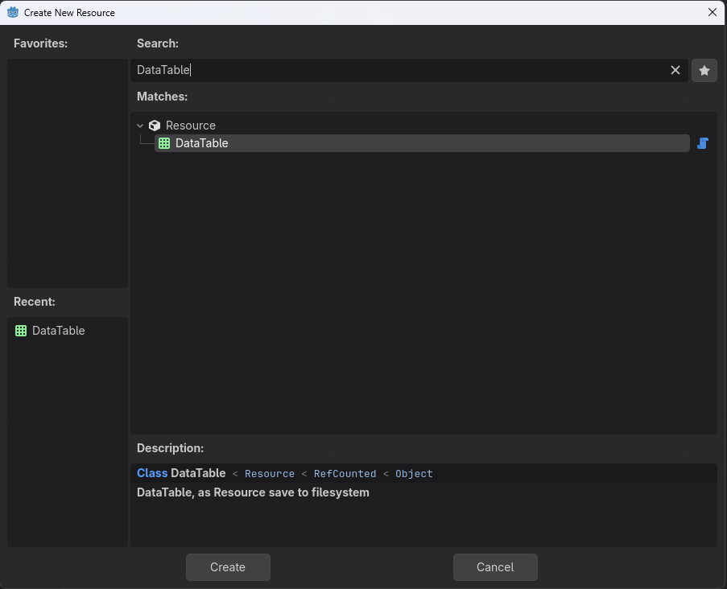
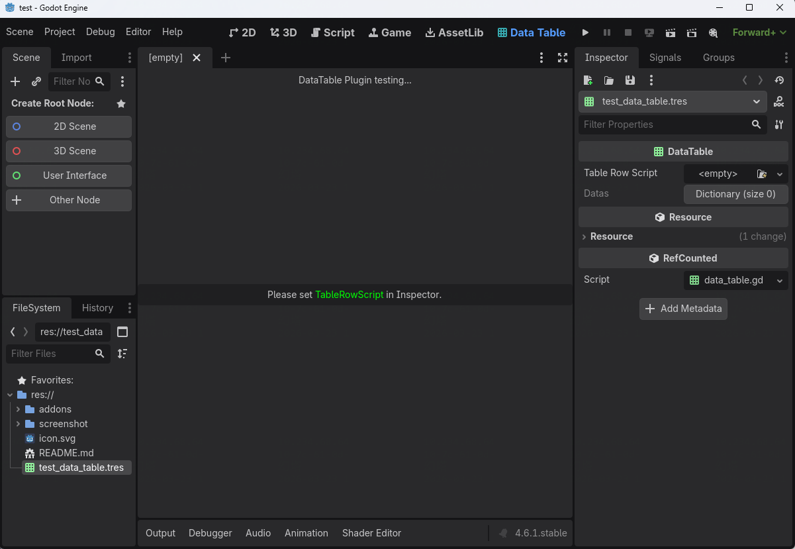
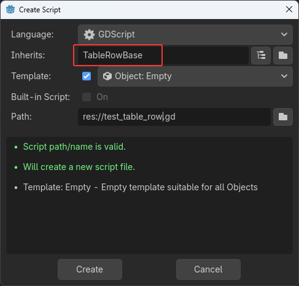
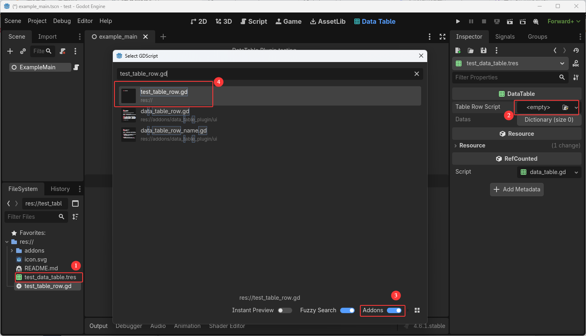
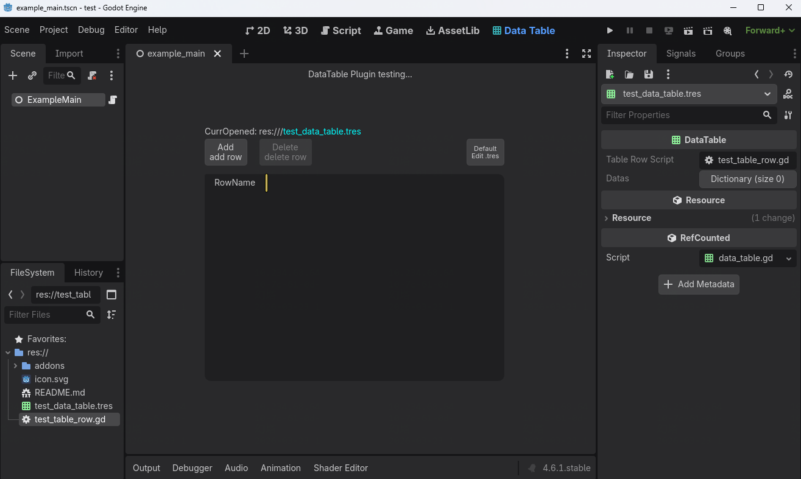
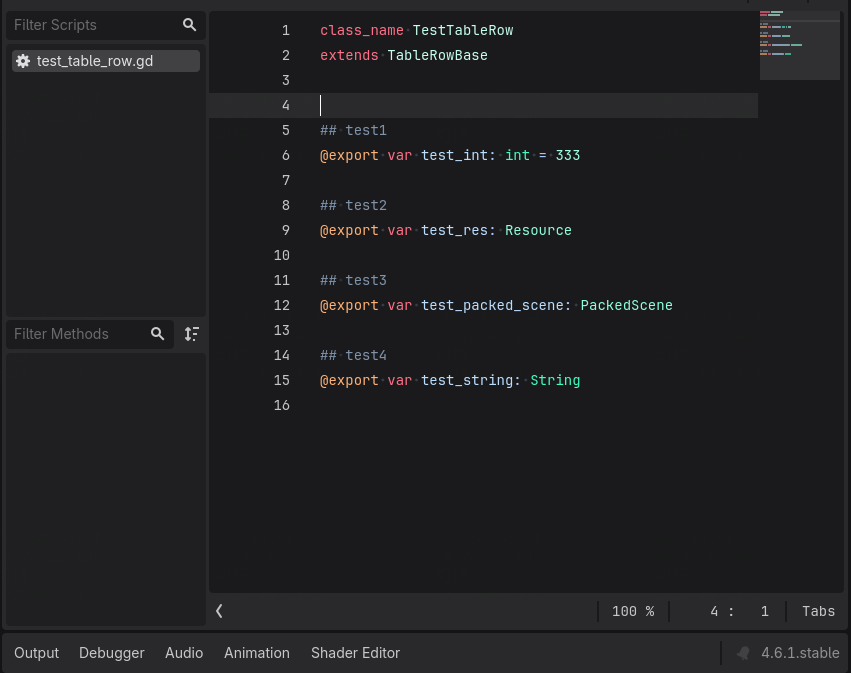
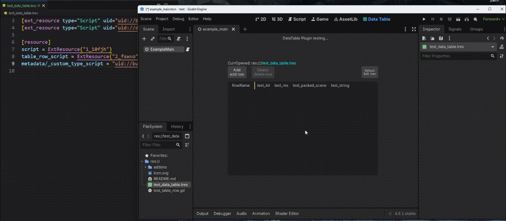

[中文](#godot-data_table_plugin) | [English](#godot-data_table_plugin-1)


# godot-data_table_plugin
数据表格插件，可以创建一个`Resource`类型的表格类，然后在godot中编辑它。


## 特性
- 使用Resource作为表格，表格数据存储在Dictionary中，插件创建了UI使其可读性提高
- 固定表结构元素类型，但一个表结构就需要创建一个Script
- 使用检查器面板设置数据


## 用法
*首先需要在项目设置中开启本插件：Menu->Project->Project Settings->Plugins-> Enabled DataTablePlugin*
### 1. 在FileSystem中右键创建一个`Resource`，类型选择`DataTable`


### 2. 双击新创建的资源例如test_data_table.tres


### 3. 在FileSystem中再次右键创建一个`Script`，脚本类型继承自`TableRowBase`，例如test_table_row.gd


### 4. 打开test_data_table.tres，设置其`属性TableRowScript`为刚刚创建的test_table_row.gd，并且保存


至此，已经创建了一个DataTable并且其表格数据结构是空的(因为还未定义类型)。

### 5. 打开test_table_row.gd，定义一些`@export类型的变量`，并且保存


### 6. 打开test_data_table.tres，会发现已经出现了表结构，并且可以点击"Add/Delete"按钮，也能编辑数据(编辑会实时保存到.tres文件中)



## `DataTable`接口
```
func find_row(row_name: String, warn_if_row_missing: bool = true) -> TableRowBase
func foreach_row(callback: Callable) -> void
```


## 实现原理
**DataTable**: 一个`Resource`类型，在其中声明了一个`Dictionary`作为储存数据的变量  
**TableRowBase**: 一个`Object`类型，需要被用户继承并且需要在子类中声明`@export var`  

*运作原理就是`TableRowBase子类`定义了表结构，`DataTable`引用它。*  
**序列化**_：当在编辑器UI中增加一行Row的时候，会new一个`TableRowBase子类`对象，然后其实例放入到`DataTable的data`中，当`ResourceSaver.save(DataTable)`时候引擎会自动序列化这个data。_  
**反序列化[到编辑器ui]**_：遍历data，同时new Object(用于检查器编辑) 和 new所需要的UI，并且用`var_to_str`将data的数据反序列化到UI中_  
**反序列化[game运行时]**_：遍历data直接读取即可，只不过插件将原来的Variant类型转换成了`TableRowBase子类`_  
**检查器面板**_: 直接调用`EditorInterface.get_inspector().edit(Object)`即可编辑某个`Object`_


## TODO
1. 编辑器UI-拖动Row以调整其位置
2. 编辑器UI-复制粘贴某行数据
3. 编辑器UI-搜索文本内容


# godot-data_table_plugin
A data table plugin that allows you to create a `Resource` and edit it in godot.


## Features
- Use Resource as the table, with table data stored in a Dictionary. The plugin provides a UI to improve readability.
- Fixed table structure element types, but each table structure requires creating a Script.
- Use the inspector panel to set data.


## Usage
*First, you need to enable this plugin in the project settings: Menu -> Project -> Project Settings -> Plugins -> Enabled DataTablePlugin*
### 1. Right-click in the FileSystem to create a new `Resource`, and select `DataTable` as the type.


### 2. Double-click the newly created resource, e.g., test_data_table.tres.


### 3. Right-click again in the FileSystem to create a new `Script`, with the script type `inheriting from TableRowBase`, e.g., test_table_row.gd.


### 4. Open test_data_table.tres, set its `TableRowScript property` to the newly created test_table_row.gd, and save.


At this point, you have created a DataTable with an empty table structure (since no fields have been defined yet).

### 5. Open test_table_row.gd, define some `@export variables`, and save.


### 6. Open test_data_table.tres again, and you will see the table structure has appeared. You can now click the "Add/Delete" buttons and edit the data (editing will be saved to the .tres file in real-time).


## `DataTable` Interface
```
func find_row(row_name: String, warn_if_row_missing: bool = true) -> TableRowBase
func foreach_row(callback: Callable) -> void
```


## Implementation principle
**DataTable**: A `Resource` type that declare a `Dictionary` as the variable for storing data.  
**TableRowBase**: An `Object` type that needs to be inherited by the user, with `@export var` declared in the subclass.

*The operating principle is that the `TableRowBase subclass` defines the table structure, and `DataTable` references it.*  
**Serialization**_: When a row is added through the editor UI, a new `TableRowBase subclass` object is created and its instance is placed into the DataTable's data. When `ResourceSaver.save(DataTable)` is called, the engine automatically serializes this data._  
**Deserialization[to Editor UI]**_: Foreach the data to new Object(for inspector) and new UIRow, and use `var_to_str` to show value in main ui_  
**Deserialization[in game]**_: Foreach data and direct read, the plugin only new a `TableRowBase subclass` for read_  
**Inspector Panel**_: Directly call `EditorInterface.get_inspector().edit(Object)` to edit a specific Object._


## TODO
1. Editor UI - Drag a row to re-order it
2. Editor UI - Copy and paste row data
3. Editor UI - Search text content
